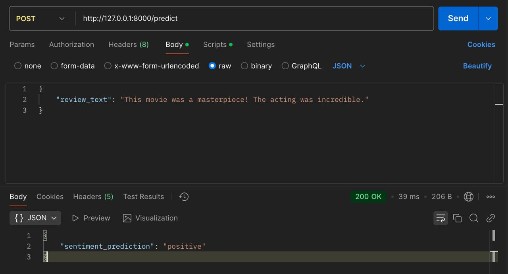

# sentiment-analysis-pipeline

#### This project implements an End-to-End Sentiment Analysis Pipeline for IMDB moviereviews, including:
- Data Collection & Storage (SQLite)
- Data Cleaning & Exploratory Analysis
- Model Training & Evaluation
- Flask API for Predictions
- Pre-built Docker Image for Easy Setup

## Note: Use a Virtual Environment (Recommended)

To avoid package conflicts, it’s recommended to use a Python virtual environment.

### Create & Activate Virtual Environment

#### For Windows

``` 
python -m venv venv
venv\Scripts\activate
```

#### For macOS/Linux
```
python3 -m venv venv
source venv/bin/activate
```

Now, proceed with installing dependencies. 

## Database Setup (SQLite)

This project uses **SQLite3** to store chat history in chat_history.db.
No additional database setup is required—SQLite works out-of-the-box.

# Usage 
##  Step 1: Run Locally

### 1.1 Clone the Repository
``` git clone https://github.com/Megatron91/sentiment-analysis-pipeline.git```
``` cd sentiment-analysis-pipeline ```

### 1.2 Install Dependencies
```pip install -r requirements.txt```

### 1.3 Start the Flask API

``` python app.py```

The API will start at http://127.0.0.1:8000/


### 1.4 Test the API
#### Using curl
```curl -X POST http://127.0.0.1:8000/predict -H "Content-Type: application/json" -d '{"review_text": "This movie was amazing!"}'```

#### Using Python
```
import requests

url = "http://127.0.0.1:8000/predict"
data = {"review_text": "This movie was fantastic!"}

response = requests.post(url, json=data)
print(response.json())  # Expected Output: {"sentiment_prediction": "positive"}

```

## Step 2: Run with Docker

### 2.1 Pull Pre-built Docker Image
```docker pull 812693/flask-sentiment-api``` # Make sure Docker is installed and running.

### 2.2 Run the Docker Container
```docker run -p 5000:5000 812693/flask-sentiment-api``` 

### 2.3 Test API Inside the Container
```curl -X POST http://127.0.0.1:5000/predict -H "Content-Type: application/json" -d '{"review_text": "This movie was amazing!"}'```


## Step 3: Test API with POSTMAN

- Open Postman and create a new request.
- Method: POST
- URL: http://127.0.0.1:8000/predict
- Headers:  Content-Type: application/json
- Body (Raw JSON): 
```json 
    {
        "review_text": "This movie was a masterpiece! The acting was incredible."
    } 
```

- Click Send and check the response.




## 7. Project Structure
```
├── models/                          # Trained model and vectorizer
│   ├── sentiment_model.pkl          # Saved logistic regression model
│   ├── tfidf_vectorizer.pkl         # Saved TF-IDF vectorizer
│
├── app.py                            # Flask API for model serving
├── load_data.py                      # Loads IMDB dataset into SQLite
├── data_cleaning_eda.py               # Cleans text & performs EDA
├── model_training.py                  # Trains the sentiment classifier
├── requirements.txt                    # List of dependencies
├── Dockerfile                          # Docker container setup
└── README.md                           # Project documentation

```